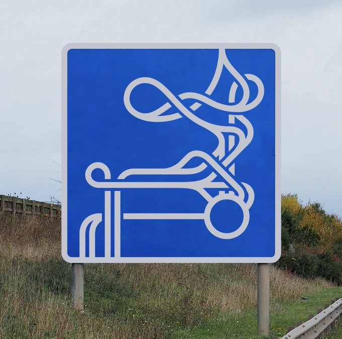

# nimbi

## "nimbi"?

**nimbi** is a latin word, the plural form of **nimbus**, a kind of cloud that bears rain.

## What's nimbi?

**nimbi** is a canvas, a placeholder for thoughts, articles, side-projects, etc. to be called my own.

Technically, the target was to deploy a self-made frankenweb, SPA + CMS, 100% client-side, with lots of random CSS stuff and **based on markdown files**. To achieve this, I have built a tool called [nimbiCMS](brochure.md) that's now available as an Open Source project

The blueprint of **nimbi** is something like this

I don't know where is it headed to, but, in the meantime, let's have fun while listening to good music.

Note: **Have you realized there's no privacy banner here?** That's because there's `no tracking` here. No cookies, no footprint, no spy pixel... If you find anything like that here, it was injected by the hosting without my knowledge, please contact me.
