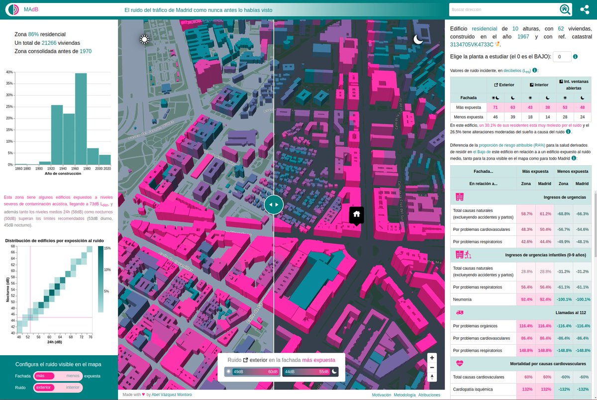
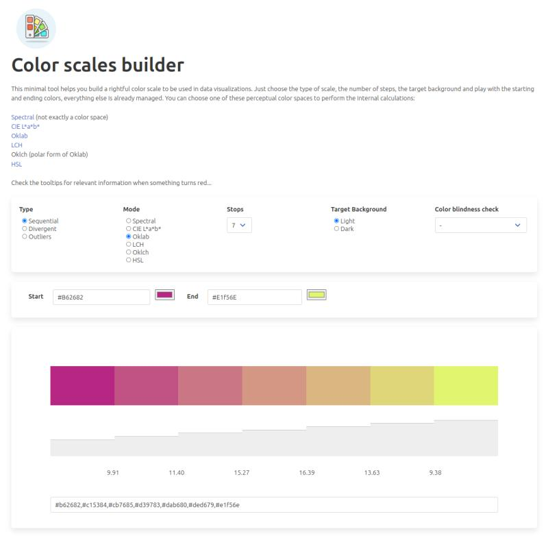
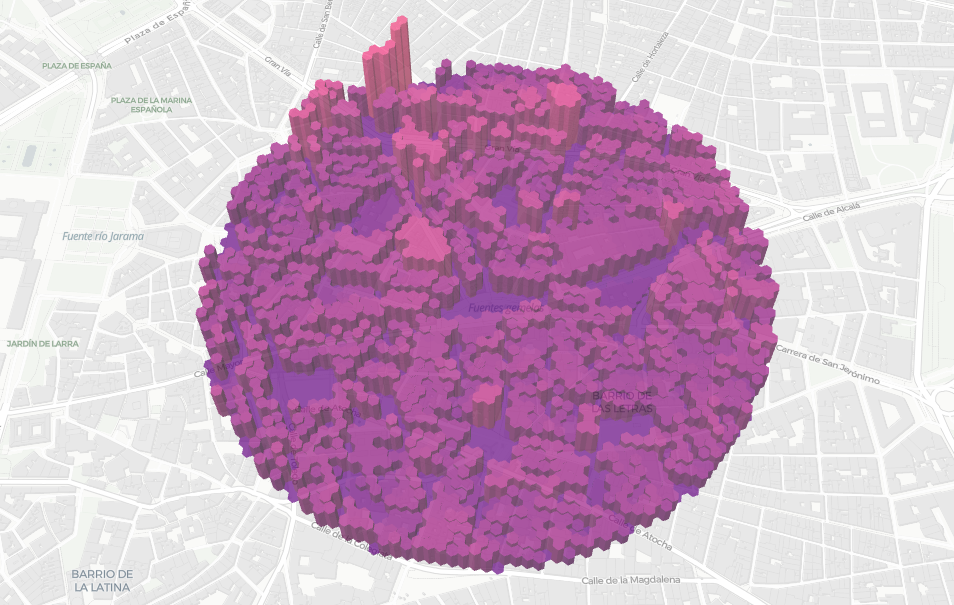
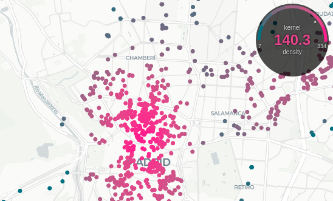
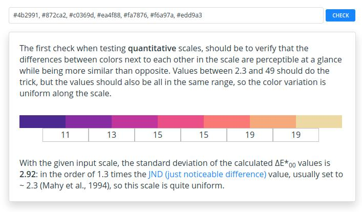
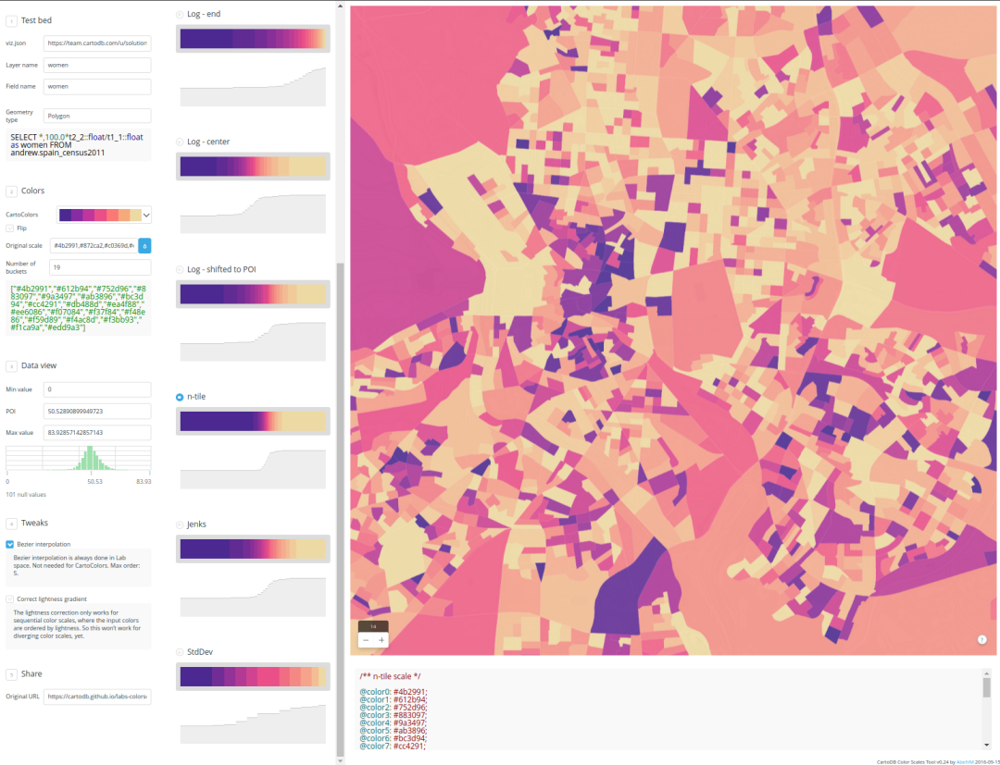

# Tech Experiments

This section covers present and past side proyects. Some of them are full tools, some other are plugis or libs.

## MAdB

[MAdB](https://madb.netlify.app) is a self-contained graphical tool designed to asset the relative health risks caused by traffic noise in the city of Madrid.

## Color Scales Builder

[Color Scales Builder](https://abelvm.github.io/colortool/) is a tool that helps you design a proper color scale for your data visualizations, and check its validity in different environments. It work for dogs too 😅

## H3T - H3J

[H3T - H3J](https://github.com/AbelVM/h3j-h3t) are light and fast H3 data formats for client side geometry generation and rendering using MapLibreGL JS `addProtocol`, both as tiled source (H3T) or file source (H3J)

## Dynamic gauge legend for MapLibreGL JS

[This simple control]((https://github.com/AbelVM/gauge_legend) adds a dynamic legend component to a MapLibre GL map, where, for a given layer and numeric property, the average value of this property for the features currently rendered is displayed and a tick points to its position in the gauge scale.

## MapLibreGL JS Preload

[maplibre-preload](https://github.com/AbelVM/maplibre-preload) is a tiny, zero-configuration plugin for preloading tiles and smoothen the experience when using targeted movements in MapLibreGL JS

## Is your color scale good enough for humans?

[Is your color scale good enough for humans?](https://abelvm.github.io/perceptualcalc/) Assets one of the problems when designing or choosing color scales for cartographic design: the need of not lying with the colors. Let's say that one of your colors is "accidentally" highlighting some range/category. Or the color separation is not enough...

## CCST

[CCST](https://cartodb.github.io/labs-colorscales) is a color scales designer and tester, focused on cartographic desig
