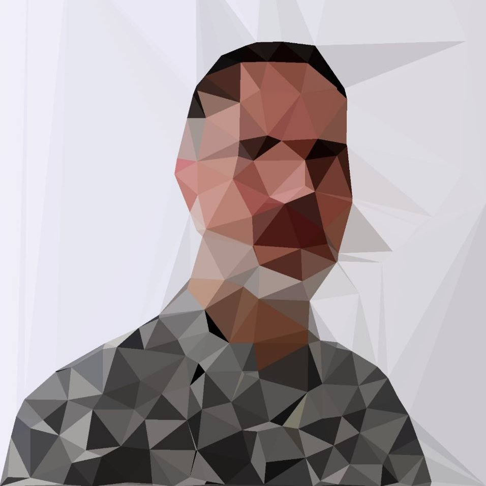

# Abel Vázquez Montoro

## Who am I?

Engineer, generalist, diagonal thinker, map lover, hungry reader, tsundoku victim, music breather, plants & cats lover, Spatial-data-centric problems solver, bullshit allergic, GIFs are my 2nd language, walker & hiker.

Focused on solving geospatial data problems since 2005, at companies like [idealista](https://www.idealista.com/), [inspide](https://inspide.com/), [urban Data Analytics](https://www.urbandataanalytics.com/), [CARTO](https://carto.com/), [GeoNet](https://www.geonet.es/) or [Aircraft Noise Technologies](https://www.anotecengineering.com/).

Huge [Postgres](https://www.postgresql.org/) fan.

Hint: Specialization is for insects.

## Where am I?

I'm located on the sunny east coast of Spain, quite close to the sea. Andalusian by birth, Madrilenian by upbringing, `Alicantinian` by choice.

## I read

Anything but non-fiction. Reading an essay or thesis or technical article is not reading, it is studing. And I'm in a continuous cycle of knowledge improvement, refurbishment and polishment, all day long, so when I read, I really need to experience emotions. Reading is an activity meant to help you evade from reality and open the door to restful sleep.

Quite partial to Sci-Fi, noir, thriller, horror, comedy books and graphic novels.

I used to mantain a profile at [GoodReads](https://www.goodreads.com/user/show/103777269-abelvm), but once the lockdown ended, I gave it up. Too many books at home to add to the list.

## I listen to

I'm, somehow, a `metalhead` open to any other music style. From the darkest to the campest. Addicted to live music.

## I collect

* **Books**. Any.

Achtung: No, not any, f*ck the unbearable, overrated `The Infinite Jest`.

* **Illustrations and paintings**. Specially attracted by [risographs](https://www.riso.co.jp/english/company/risoart/index.html) and original weird pieces. As of today, looking for a special large-format artwork.
* **Plants**. Lots of them. The weather here is so inviting.

I might say that the amount I own of the following items could also be considered "collections" 😅

* Sunglasses
* Backpacks
* Trail sneakers
